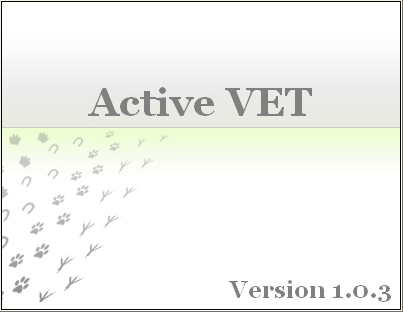



## Active VET

### Description

Active VET is complete veterinary managment software,

designed to serve small and middle vet practicing consulting rooms.

Current version includes roentgenography module,

clinical and laboratory information sections, therapy and diagnose modules.
 
### More Info
 

             |
---                |---
**Submitted On**   |2005-06-30 10:55:38
**By**             |[Petar Atanasov](https://github.com/Planet-Source-Code/PSCIndex/blob/master/ByAuthor/petar-atanasov.md)
**Level**          |Advanced
**User Rating**    |4.9 (54 globes from 11 users)
**Compatibility**  |VB 6\.0
**Category**       |[Complete Applications](https://github.com/Planet-Source-Code/PSCIndex/blob/master/ByCategory/complete-applications__1-27.md)
**World**          |[Visual Basic](https://github.com/Planet-Source-Code/PSCIndex/blob/master/ByWorld/visual-basic.md)
**Archive File**   |[Active\_VET190767712005\.zip](https://github.com/Planet-Source-Code/petar-atanasov-active-vet__1-61436/archive/master.zip)

